# Multi Domain POC

- **Subdomain System**: Configure and manage a subdomain for a multi-tenant application.
- **Custom Domain Integration**: Easy way to integrate custom domain with existing application.

This is a proof-of-concept project on how wildcard domains work. Additionally, we added a way to support a custom domain. We will be able to add a custom domain if they want to. For simplicity, we made the app simple since it's a POC project. On our frontend side, you are only allowed to view the created project and update some information about the existing project.

We can use the API to create a project. Each project will work like an independent app. Where each project will have a subdomain. With that subdomain, we can access our newly created project data. The subdomain will be abc.example.com. Also, we can integrate our custom domain with a project.

## High-Level Architecture (Single Server)

```mermaid
graph TB
    %% External Components
    User[👤 User]
    DNS[🌐 DNS Provider]
    Internet[🌍 Internet]

    %% Load Balancer / Reverse Proxy
    subgraph "Load Balancer / Reverse Proxy"
        Nginx[🔀 Nginx]
        SSL[🔒 SSL/TLS Certificates]
    end

    %% Application Services
    subgraph "Application Services"
        API[🚀 API Server<br/>FastAPI - Port 8000]
        Static[📁 Static Server<br/>FastAPI - Port 8080]
        ScriptExec[⚙️ Script Executor Internal<br/>FastAPI - Port 9090]
        DB[(🗄️ MongoDB<br/>Port 27017)]
        StaticFiles[📄 Static Files<br/>/static directory]
    end

    %% External Services
    Certbot[🔐 Certbot<br/>Let's Encrypt]

    %% User Connections
    User -->|HTTPS| Internet
    Internet --> Nginx

    %% DNS Setup
    DNS -->|TXT Records for verification| Internet
    DNS -->|CNAME Records| Internet

    %% Nginx Routing
    Nginx -->|api.example.com| API
    Nginx -->|*.example.com| Static
    Nginx -->|custom-domains| Static

    %% Service Dependencies
    API --> DB
    Static --> DB
    Static --> StaticFiles

    %% SSL Certificate Management
    Certbot --> SSL
    Certbot --> Nginx

    %% Internal API Calls
    API -->|HTTP| ScriptExec

    %% Configuration Updates
    ScriptExec -->|Updates| Nginx

    style User fill:#2196F3,stroke:#1976D2,stroke-width:2px,color:#fff
    style API fill:#4CAF50,stroke:#388E3C,stroke-width:2px,color:#fff
    style Static fill:#FF9800,stroke:#F57C00,stroke-width:2px,color:#fff
    style ScriptExec fill:#9C27B0,stroke:#7B1FA2,stroke-width:2px,color:#fff
    style DB fill:#F44336,stroke:#D32F2F,stroke-width:2px,color:#fff
    style Nginx fill:#00BCD4,stroke:#0097A7,stroke-width:2px,color:#fff
```

## Overall Project Structure

For simplicity, we don't have any authentication, and security best practices are ignored. This is A POC project and not meant to be used in production directly. Most of the things we tried to keep simple.

- **API App**: Will store and manage metadata about the project. This will serve the necessary APIs. We will use a single API to expose the API server like "api.example.com".
- **Script Executor**: This service will be used for internal execution and managing configuration.
- **Static App**: This app will serve the static files to the targeted subdomain or custom domain. In this app, we mainly serve content based on pre-configured data.
- **Data Base**: For simplicity, we are using MongoDB. A single database will be shared between the *API App* and *Static App*.

## Project Flow

For this project, most of the action is taken by the API. We have a simple UI to validate if we can use the project on our targeted domain.

Open the url like `api.example.com/docs` in the browser.

**New Project:**

- Create a project with the API `/api/projects/` method `POST`. It will provide you with the project_id, subdomain, etc.
- You should be able to access the app with `<subdomain>.example.com`.

**Custom Domain:**

- Add a custom domain with the existing project ID. Use the `/api/projects/{project_id}/custom-domain` API to add the custom domain.
- It will respond with a TXT record 'host' and 'value'. Add that record to your domain provider to validate your domain.
- You can use the API `/api/projects/{project_id}/custom-domain/instructions` to get full instructions for the integration.
- Use the API `/api/projects/{project_id}/verify-domain` to validate your domain.
- Use your subdomain to point to the custom domain. For example, CNAME: "host: @, value: subdomain.example.com".
- To remove the custom domain integration, use this API `/api/projects/{project_id}/custom-domain`.

## Integrate custom domain

User the API `/api/projects/{project_id}/custom-domain/instructions` to get instruction on how you can add the custom domain to your DNS provider.

## Start the dev server

- Make copy of the file `example.env` => `.env` for the backend.
- `docker compose up server` Run the backend
- Make copy of the file `frontend/example.env` => `frontend/.env` for the frontend.
- `cd frontend && npm run dev` Run the frontend

## Start the app for build version

- `docker compose up --build frontend-builder` Build frontend.
- `docker compose build server` Build the app image.
- `docker compose up -d server static_server`

## System Documentation

### [System Architecture](./docs/architecture.md)

### [Production Readiness Checklist](./docs/production-checklist.md)

### [Reverse Proxy Setup](./docs/reverse_proxy.md)

### [Script Executor](./docs/script-executor.md)
