# Multi-Domain POC - System Architecture

## Overview

This document provides a comprehensive architectural overview of the Multi-Domain POC system, which demonstrates wildcard subdomain management and custom domain integration for multi-tenant applications.

## High-Level Architecture (Single Server)

```mermaid
graph TB
    %% External Components
    User[👤 User]
    DNS[🌐 DNS Provider]
    Internet[🌍 Internet]

    %% Load Balancer / Reverse Proxy
    subgraph "Load Balancer / Reverse Proxy"
        Nginx[🔀 Nginx]
        SSL[🔒 SSL/TLS Certificates]
    end

    %% Application Services
    subgraph "Application Services"
        API[🚀 API Server<br/>FastAPI - Port 8000]
        Static[📁 Static Server<br/>FastAPI - Port 8080]
        ScriptExec[⚙️ Script Executor Internal<br/>FastAPI - Port 9090]
        DB[(🗄️ MongoDB<br/>Port 27017)]
        StaticFiles[📄 Static Files<br/>/static directory]
    end

    %% External Services
    Certbot[🔐 Certbot<br/>Let's Encrypt]

    %% User Connections
    User -->|HTTPS| Internet
    Internet --> Nginx

    %% DNS Setup
    DNS -->|TXT Records for verification| Internet
    DNS -->|CNAME Records| Internet

    %% Nginx Routing
    Nginx -->|api.example.com| API
    Nginx -->|*.example.com| Static
    Nginx -->|custom-domains| Static

    %% Service Dependencies
    API --> DB
    Static --> DB
    Static --> StaticFiles

    %% SSL Certificate Management
    Certbot --> SSL
    Certbot --> Nginx

    %% Internal API Calls
    API -->|HTTP| ScriptExec

    %% Configuration Updates
    ScriptExec -->|Updates| Nginx

    style User fill:#e1f5fe
    style API fill:#f3e5f5
    style Static fill:#e8f5e8
    style ScriptExec fill:#fff3e0
    style DB fill:#fce4ec
    style Nginx fill:#e0f2f1
```



## Component Architecture

### 1. Reverse Proxy Layer (Nginx)

**Purpose**: Routes incoming requests to appropriate services based on domain/subdomain patterns.

**Configuration Files**:

- `backend-api.conf` - Routes `api.example.com` to API server
- `frontend.conf` - Routes `*.example.com` wildcard subdomains to Static server
- `custom-domain-http.conf` - Routes custom domains to Static server
- `custom-domain-https-conf.template` - Template for HTTPS custom domain configs

**Routing Logic**:

```text
api.example.com        → API Server (Port 8000)
*.example.com          → Static Server (Port 8080)
custom-domain.com      → Static Server (Port 8080)
```

### 2. API Server (FastAPI)

**Purpose**: Core business logic, project management, and custom domain orchestration.

**Key Features**:

- Project CRUD operations
- Custom domain verification
- DNS record generation
- Integration with Script Executor

### 3. Static Server (FastAPI)

**Purpose**: Serves tenant-specific content based on subdomain or custom domain.

**Key Features**:

- Multi-tenant content serving
- Domain-based project resolution
- Static file serving from `/static` directory
- Request routing based on `Host` header

**Request Flow**:

1. Extract domain/subdomain from Host header
2. Query MongoDB for project associated with domain
3. Serve appropriate static content
4. Return 404 if project not found

### 4. Script Executor (FastAPI)

**Purpose**: Executes system-level operations for custom domain configuration.

**Key Features**:

- SSL certificate generation via Certbot
- Nginx configuration management
- Custom domain setup automation
- Secure shell script execution

**Operations**:

- `POST /configure-custom-domain` - Creates SSL cert and Nginx config
- `POST /remove-custom-domain` - Removes SSL cert and Nginx config

### 5. Database Layer (MongoDB)

**Purpose**: Persistent storage for project metadata and domain mappings.

**Collections**:

- `projects` - Project information, subdomains, custom domains, verification status

## Domain Management Flow

### Subdomain Creation


### Custom Domain Integration


## Security Considerations

### SSL/TLS Management

- **Wildcard Certificate**: Single cert for `*.example.com`
- **Custom Domain Certs**: Individual certs per custom domain
- **Automatic Renewal**: Certbot with cron jobs

### Domain Verification

- **TXT Record Verification**: Ensures domain ownership
- **DNS Propagation Check**: Validates global DNS updates
- **Token-based Verification**: Secure random tokens for verification

### Network Security

- **CORS Middleware**: Configured for cross-origin requests
- **Trusted Host Middleware**: Host header validation
- **Reverse Proxy**: Nginx as security boundary

## Deployment Architecture

### Development Environment

```bash
docker-compose up server          # API + Static + DB
cd frontend && npm run dev        # Frontend development server
```

### Production Environment

```bash
docker-compose up --build frontend-builder  # Build static assets
docker-compose build server                 # Build application
docker-compose up -d server static_server   # Run production services
```

### Service Dependencies

```text
MongoDB (Port 27017)
└── API Server (Port 8000)
    └── Script Executor (Port 9090)
└── Static Server (Port 8080)
    └── Static Files (/static)
```

## Scaling Considerations

### Horizontal Scaling

- **API Server**: Stateless, can be load-balanced
- **Static Server**: Can be replicated behind load balancer
- **Database**: MongoDB replica sets for high availability

### Performance Optimization

- **CDN Integration**: Static assets via CDN
- **Caching**: Redis for session/domain cache
- **Database Indexing**: Subdomain and custom_domain fields

### Monitoring & Observability

- **Health Checks**: `/health` endpoints for each service
- **Logging**: Structured logging for request tracing
- **Metrics**: Performance monitoring for response times

## File Structure

```text
multi-domain-poc/
├── app/                    # API Server
│   ├── main.py            # FastAPI application
│   ├── routers.py         # API endpoints
│   ├── services.py        # Business logic
│   ├── models.py          # Database models
│   └── schemas.py         # Pydantic schemas
├── static_app/            # Static Server
│   └── main.py           # FastAPI static server
├── script_executor/       # Script Executor
│   ├── main.py           # Script execution API
│   ├── configure-custom-domain.sh
│   └── remove-custom-domain-config.sh
├── config/               # Nginx configurations
│   ├── backend-api.conf
│   ├── frontend.conf
│   ├── custom-domain-http.conf
│   └── custom-domain-https-conf.template
├── frontend/             # React frontend
├── static/              # Built static assets
└── docs/                # Documentation
    ├── reverse_proxy.md
    ├── script-executor.md
    └── architecture.md
```
