# Multi-Domain SaaS Application Architecture

## Overview

This document describes the high-level architecture of our multi-domain SaaS application that supports automatic subdomain provisioning and custom domain configuration. The application has been redesigned to use Caddy as a reverse proxy, replacing the previous Nginx-based architecture for simplified SSL certificate management and dynamic domain handling.

## High Level Architecture

```mermaid
graph TB
    %% External
    User[👤 User]
    DNS[🌐 DNS Provider]
    
    %% Core Services
    Caddy[🔀 Caddy Reverse Proxy<br/>Automatic HTTPS & SSL]
    API[🚀 API Server<br/>FastAPI]
    Frontend[📁 Frontend<br/>React/Nginx]
    DB[(🗄️ MongoDB)]

    %% Traffic Flow
    User -->|HTTPS| Caddy
    DNS -.->|Domain Records| Caddy
    
    %% Service Routing
    Caddy -->|api.example.com| API
    Caddy -->|*.example.com<br/>custom domains| Frontend
    
    %% Data Flow
    API --> DB

    %% Styling
    style User fill:#2196F3,stroke:#1976D2,stroke-width:2px,color:#fff
    style API fill:#4CAF50,stroke:#388E3C,stroke-width:2px,color:#fff
    style Frontend fill:#FF9800,stroke:#F57C00,stroke-width:2px,color:#fff
    style DB fill:#F44336,stroke:#D32F2F,stroke-width:2px,color:#fff
    style Caddy fill:#00BCD4,stroke:#0097A7,stroke-width:2px,color:#fff
```



## Sequence Diagrams

### Subdomain Request Flow


### First Custom Domain Request


## Architecture Components

### 1. Reverse Proxy Layer (Caddy)

**Caddy Server** (`proxy_server` service)

- **Purpose**: Single entry point for all HTTP/HTTPS traffic
- **Features**:
  - Automatic HTTPS with Let's Encrypt
  - On-demand TLS for custom domains
  - DNS-01 challenge support via Namecheap plugin
  - Dynamic domain validation
- **Ports**: 80 (HTTP), 443 (HTTPS), 443/UDP (HTTP/3)
- **Configuration**: `/etc/caddy/Caddyfile`

**TLS Certificate Management**:

- **Wildcard Certificates**: For `*.example.com` using DNS-01 challenge with Namecheap
- **On-Demand Certificates**: For custom domains with domain validation
- **Automatic Renewal**: Handled by Caddy automatically

### 2. Application Services

**API Server** (`server` service)

- **Technology**: FastAPI with Python 3.12
- **Domain**: `api.example.com`
- **Purpose**:
  - Project management and metadata storage
  - Domain verification and validation
  - Custom domain configuration

**Static Server** (`static_server` service)

- **Technology**: Nginx serving React/Vite frontend
- **Purpose**: Serve frontend application for subdomains and custom domains
- **Domains**:
  - `*.example.com` (subdomains)
  - Custom domains (via Caddy routing)
- **Features**:
  - SPA routing support
  - Static asset optimization
  - Gzip compression

**Database** (`db` service)

- **Technology**: MongoDB 8

### 3. Domain Management Flow

#### Subdomain Provisioning

1. User creates project via API
2. System generates unique subdomain (`{project}.example.com`)
3. Caddy automatically serves content via wildcard certificate
4. DNS wildcard record routes traffic to Caddy

#### Custom Domain Integration

1. User adds custom domain via API
2. System generates TXT record for domain verification
3. User adds TXT and CNAME records to their DNS
4. Caddy validates domain via `/api/domain-check` endpoint
5. On-demand TLS certificate issued for custom domain
6. Traffic routed to static server

### 5. Security Features

- **Domain Validation**: Custom domains validated via `/api/domain-check`
- **TLS Encryption**: All traffic encrypted with automatic certificate management
- **Network Isolation**: Services communicate via internal Docker network
- **Environment Isolation**: Separate environment files for different services

### 6. Deployment Configuration

**Required DNS Records**:

```bash
# API subdomain
Type: A Record
Host: api.example.com
Value: <server_ip>

# Wildcard for subdomains
Type: A Record  
Host: *.example.com
Value: <server_ip>
```

**Docker Volumes**:

- `multi_domain_db`: Database persistence
- `multi_domain_caddy_data`: SSL certificates and ACME data
- `multi_domain_caddy_config`: Caddy runtime configuration

This architecture provides a robust, scalable foundation for a multi-tenant SaaS application with automatic subdomain provisioning and seamless custom domain integration.
